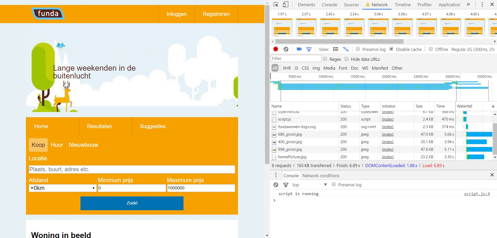
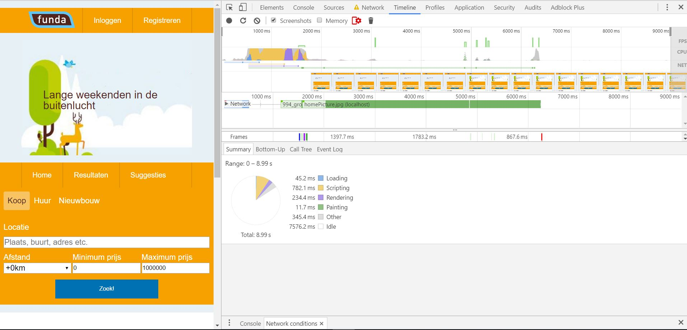

# minor-serverside-funda
### Features
- User can search on location.
- User gets to see a sugestion of possible locations (work in progress).
- User can search on distance form location
- User can search with a min and max price
- User can see houses in a list.
- User gets to see suggested houses, that did almost fit his or here search query. (suggestions)

### Usage
The user wants to look for a house. With all the filters and features, the user can easally search through all the houses. At the same time, the app will look for houses, that liks for a house and while doing so, he/she will get suggestions for houses, that did almost fit his or here search query. This way, the user might find a house, that she normally would not have found.

### Directories
- bin
    -www
- node_modules
- public
    - images
    - Javascript
    - stylesheets
- routes
- views


### Wishlist
- Autosuggestion api
- User sessions
- Loaders/easy loading
- Optimise loading
- Minimize content.
- Google map api
- Img compression
- Critical css


### Sources:
- https://github.com/wooorm/dictionary
- https://expressjs.com/en/starter/generator.html
- https://www.npmjs.com/package/dotenv
- https://www.npmjs.com/package/request
- https://codepen.io/postleonardo/pen/PwdQmv


## Funda
#### The Funda app
Homepage


Search results page


Suggestions page


#### Autofill search
The app without javascript will use the system Autosuggestions, that are you previous searches.

```
//If javascript works the autocomplete will be turned off when loaded.
input.setAttribute("autocomplete","off");

```

With working javascript, the system Autosuggestions will be turned off and my own suggestions (with the funda api/ work in progress) will be used.


#### Funda speed insight
PageSpeed Insights desktop:


PageSpeed Insights mobile:


#### Chorme developer tools
Loadingtime


Activities

