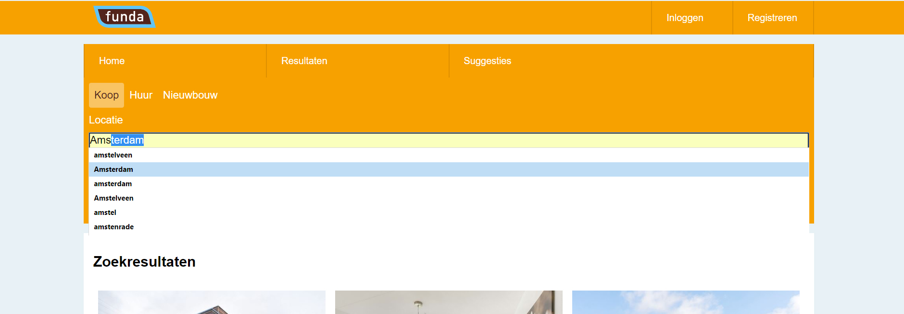
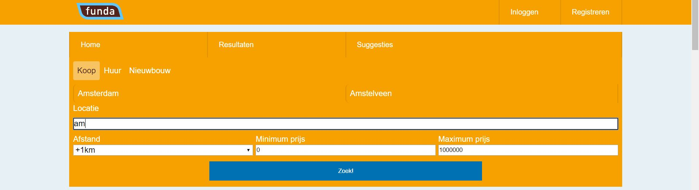
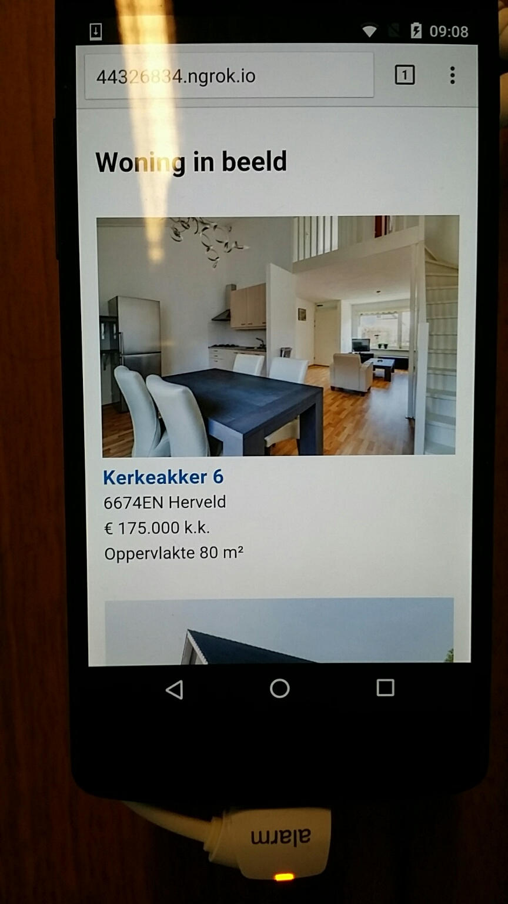

# Minor WebDev | ServerSide-Funda
This is a ServerSide version of the funda web application enchanced, with javsascript enhancements.

The gets to see a list with different houses. If the user would like to search for a house, he/she could type in a name and press search and the results will be showed.

The javascript enhancements turn off the systam Autosuggestions and uses my own autosuggestion. This way, the user gets to see possible suggestions, while he/she is typing in the search bar. If the user clicks on one of the suggestions. The answer will be placed in the input field and will be ready to search.

`
V 1.0.7
`
## Installing
### Stap 1: Cloning
```
$ git clone https://github.com/ColinDorr/minor-serverside-funda.git
```

### Stap 2: Preparing
- Create a .env file in the minor-serverside-funda folder (same level as the package.json)

- Fill `.env` with Funda json url and the Funda key. For exmaple:
```
URL=http://funda.kyrandia.nl/feeds/Aanbod.svc/json/
API_KEY=1234ThisWillBeTheFundaKey
```
- After creating the .env file and giving it the correct values, oyu are ready to run the application.

### Stap 3: Running
- Go the console and find the minor-serverside-funda folder.
- In the minor-serverside-funda folder use ``npm install`` to install the necessary node modules.
- Afterwards use ``npm start``, to start the application. The applications is now running on your local host on http://localhost:3000/ .

#### Localhost
- To install the node modules
```
$ npm install
$ npm start
```
It should return something like this:
```
[nodemon] 1.11.0
[nodemon] to restart at any time, enter `rs`
[nodemon] watching: *.*
[nodemon] starting `node ./bin/www`
started on port 3000!
```

-   If `npm start` throws an `error` please check if port `3000` is free.

#### Online exposure
if you want to test it online. You can use the expose function.
- Open a extra console and find the minor-serverside-funda folder.
- Do ``npm run expose``, to expose it to internet.
```
$ npm run expose
```
you will get something like this:
```
Session Status                online
Version                       2.1.18
Region                        United States (us)
Web Interface                 http://127.0.0.1:4040
Forwarding                    http://897dd0cb.ngrok.io -> localhost:3000
Forwarding                    https://897dd0cb.ngrok.io -> localhost:3000
```

- If you now go to the weird https://897dd0cb.ngrok.io type of linke. you will find your live sersion.


### Features
- User can search on location.
- User gets to see a sugestion of possible locations (work in progress).
- User can search on distance form location
- User can search with a min and max price
- User can see houses in a list.
- User gets to see suggested houses, that did almost fit his or here search query. (suggestions)
- Works offline with ServiceWorker.
- Works without JavaScript.


### Usage
The user wants to look for a house. With all the filters and features, the user can easally search through all the houses. At the same time, the app will look for houses, that liks for a house and while doing so, he/she will get suggestions for houses, that did almost fit his or here search query. This way, the user might find a house, that she normally would not have found.

### Directories
- bin
    -www
- node_modules
- public
    - images
    - Javascript
    - stylesheets
- routes
- views

## Accessibility
### Color
#### Normal

The colors, that I have used in my design are:
- Header: ``##f7a100``,
- Background: ``#e7f1f5``
- Buttons: ``#0071b``.

I chose these colors, because they match the colerschema of the Funda website and because they work wel together. Only the white on the orange is a bit tricky for people with bad eyesight, but this was Funda's style and that's why I did not change it.

(If I would change it, I would make the orange buttons a bit darker and make the white letters font-weigth bigger. ") and the website have a consistent thema in common.

#### Black and white


#### partial blindness


### Tab-navigation
Nowadays a website should be accessable, for everyone. That's why the site should also be able to bu used without a mouse or touchpad.

Thats why I build my web application, so that users could use the tab, to navigate through the side. In the picture above, you can see the path, the user takes by using the tab to navigate. And the navigation is logical an easy to use.


Possible inprovements:
- [ ] Make link text better, by adding more explaining data, without getting to long (is now adres, could be better).

### Screanreader

I also used the 'ChromeVox' screanreader extension in Chrome, to check if my web applications was also accessable for people, who are partial or completely blind.

The results from the screanreader where pretty good, if I say so myself. Everything was read and was clear to understand.

#### Javascript
Because most of the functions of the web application are getting renderd on the server. You could turn off the javsascript and everything would still work. The user would still get to see the list with links and he/she could still search..

The only difference between the site with and without javscript is, that without javascript, the custom autocomplete will not get displayed. But the system autocomplete (previous searched items) will get displayed.

###### Javascript Autocomplete
When the javascript gets succesvolly loaded. Hide the autocomplete.
// if the javascript works. Turn off the autocomplete.
// else, the javascript does not load and the fallback is the normal  system autocomplete.

PS. The autocomplete attribute does not exist in IE8 and lower. Because of this the javascript will not work and the user will have no custom autosuggest.


```
// turn off the autocomplete on the search input field
input.setAttribute("autocomplete","off");


// If the user types something, this function checks the users input and makes a custom autocomplete for him/her.

input.addEventListener("keyup", startAutoSuggest);
    function startAutoSuggest(e) {
      if (input.value.length > 0) {
          var val =input.value.toLowerCase()
          document.getElementById("autocomplete-results").style.display = 'block';
          autocomplete_results.innerHTML = '';
          autocompleteList(val);
        }
        else{
            document.getElementById("autocomplete-results").style.display = 'none';
            autocomplete_results.innerHTML = '';
        }
      }
............

```


Possible inprovements:
- [ ] Make the autocompletes tabable. Now they are just list items.


Below I have place some screenshots of the different stages of IE8 , IE9 , IE10 and IE11, because if it works there it will work almost everywhere.


## Funda
#### The Funda app


#### Funda speed insight
PageSpeed Insights desktop:


PageSpeed Insights mobile:


## Photo's DeviceLab
##### All screens


##### Big tablet landscape
Everything is the right size and it lookst nice. It all works and looks good on landscape orientation. It also loads fast.


##### Normal tablet portrait
On portrait mode, the side looks nice, but the distance selection looks different from the rest of the inputs, what is not that nice.


##### Mobile portrait
On mobile, the website works and everything loads fast and is accessable.



## Loading speed
 | Throttling      |  Requests   | Transferred     | DOMContentLoaded  | Load          | Finished      |
 | :-------------  | :---------    | :-------------   | :----------                |  :---------- | :---------- |
 | '   GPRS  '      | '  20   '      | ' 164kb    '| '   2.46s  '              | '   28.87s  '  |  '   44.06s  '|
 | '   2G  '           | '  20   '      | ' 164kb    '| '  1.28s  '                | '   6.69s  '|  '   6.69s '|
 | '   3G  '           | '  20   '      | ' 164kb    '| ' 1.02s  '                | '   2.88s  '|  '   2.88s  '|
 | '   4G  '           | '  20   '      | ' 164kb    '| '  1.00s  '                | '   1.40s  '|  '   2.41s  '|
 | '   Wifi  '         | '  20   '      | ' 164kb    '| '   768ms  '               | '   862ms  '|  '   2.12s  '|
 | '   No throttling  '| '  20   '      | ' 164kb    '| '   823msms '                | '   927ms  '| '   2.24 '|


 ## Wishlist/ To do
 - [x] Autosuggestion api
 - [x] Improve Performace.
     - [x]Img compression/ Picture element (responsive img choice).
     - [x] Minimize content.
     - [x]Responsive picture element.
     - [x]Critical css.
     - [x]Gzip conpression.
- [ ] Make the autocompletes tabable. Now they are just list items.

 Optional:
 - [ ] Google map api (I made that in the previous funda webapp.)
 - [ ] Make link text better, by adding more explaining data, without getting to long (is now adres, could be better).

 ### Sources:
 - https://github.com/wooorm/dictionary
 - https://expressjs.com/en/starter/generator.html
 - https://www.npmjs.com/package/dotenv
 - https://www.npmjs.com/package/request
 - https://codepen.io/postleonardo/pen/PwdQmv
 - https://github.com/TimoVerkroost/minor-performance-matters-funda/blob/master/public/sw.js
 -https://www.html5rocks.com/en/tutorials/responsive/picture-element/
