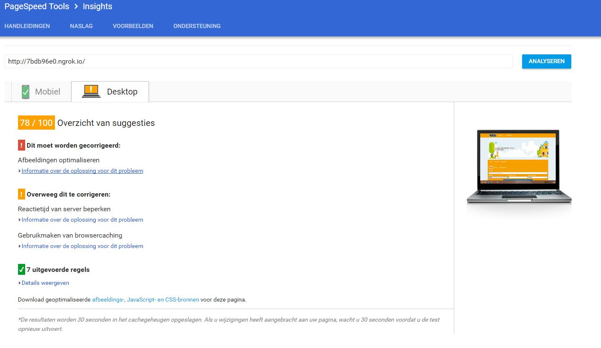

# Minor WebDev | ServerSide-Funda
ServerSide version of the funda web app.
`
V 1.0.7
`
## Installing
### Stap 1: Cloning
```
$ git clone https://github.com/ColinDorr/minor-serverside-funda.git
```

### Stap 2: Preparing
- Create a .env file in the minor-serverside-funda folder (same level as the package.json)

- Fill `.env` with Funda json url and the Funda key. For exmaple:
```
URL=http://funda.kyrandia.nl/feeds/Aanbod.svc/json/
API_KEY=1234ThisWillBeTheFundaKey
```
- After creating the .env file and giving it the correct values, oyu are ready to run the application.

### Stap 3: Running
- Go the console and find the minor-serverside-funda folder.
- In the minor-serverside-funda folder use ``npm install`` to install the necessary node modules.
- Afterwards use ``npm start``, to start the application. The applications is now running on your local host on http://localhost:3000/ .

#### Localhost
- To install the node modules
```
$ npm install
$ npm start
```
It should return something like this:
```
[nodemon] 1.11.0
[nodemon] to restart at any time, enter `rs`
[nodemon] watching: *.*
[nodemon] starting `node ./bin/www`
started on port 3000!
```

-   If `npm start` throws an `error` please check if port `3000` is free.

#### Online exposure
if you want to test it online. You can use the expose function.
- Open a extra console and find the minor-serverside-funda folder.
- Do ``npm run expose``, to expose it to internet.
```
$ npm run expose
```
you will get something like this:
```
Session Status                online
Version                       2.1.18
Region                        United States (us)
Web Interface                 http://127.0.0.1:4040
Forwarding                    http://897dd0cb.ngrok.io -> localhost:3000
Forwarding                    https://897dd0cb.ngrok.io -> localhost:3000
```

- If you now go to the weird https://897dd0cb.ngrok.io type of linke. you will find your live sersion.


### Features
- User can search on location.
- User gets to see a sugestion of possible locations (work in progress).
- User can search on distance form location
- User can search with a min and max price
- User can see houses in a list.
- User gets to see suggested houses, that did almost fit his or here search query. (suggestions)

### Usage
The user wants to look for a house. With all the filters and features, the user can easally search through all the houses. At the same time, the app will look for houses, that liks for a house and while doing so, he/she will get suggestions for houses, that did almost fit his or here search query. This way, the user might find a house, that she normally would not have found.

### Directories
- bin
    -www
- node_modules
- public
    - images
    - Javascript
    - stylesheets
- routes
- views


## Wishlist/ Todo
- [ ] Autosuggestion api
- [ ] User sessions
- [ ] Improve Performace
    - [ ] Minimize content.
    - [ ]Img compression
    - [ ]Critical css

Optional:
- [ ] Google map api
- [ ] Loaders/easy loading

### Sources:
- https://github.com/wooorm/dictionary
- https://expressjs.com/en/starter/generator.html
- https://www.npmjs.com/package/dotenv
- https://www.npmjs.com/package/request
- https://codepen.io/postleonardo/pen/PwdQmv


## Funda
#### The Funda app
Homepage


Search results page


Suggestions page


#### Autofill search
The app without javascript will use the system Autosuggestions, that are you previous searches.

```
//If javascript works the autocomplete will be turned off when loaded.
input.setAttribute("autocomplete","off");

```

With working javascript, the system Autosuggestions will be turned off and my own suggestions (with the funda api/ work in progress) will be used.


#### Funda speed insight
PageSpeed Insights desktop:


PageSpeed Insights mobile:


#### Chorme developer tools
Loadingtime


Activities

